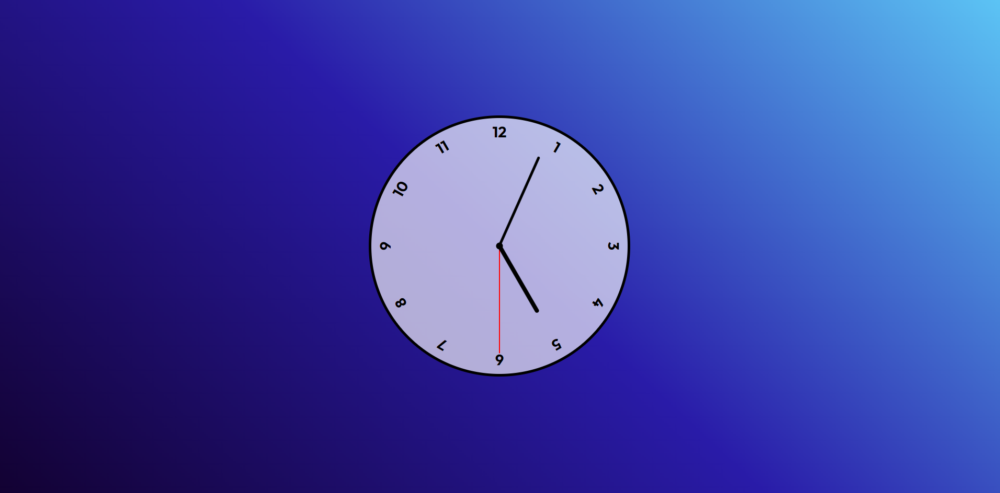

Projeto finalizado, seguindo a vídeo-aula do Felipão (Felipe Rocha)

Caso queira ver funcionando, clique no link abaixo:

https://martins-pedro.github.io/projeto-relogio-JS/

# Feito para praticar HTML, CSS e JS!

Créditos: https://www.youtube.com/watch?v=Dq8S6wOeAdE
